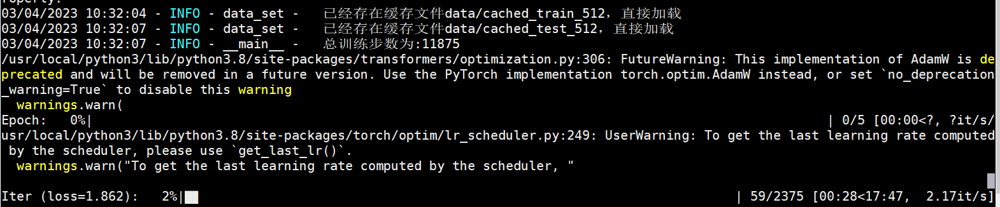

本项目为书籍《ChatGPT原理与实战：大型语言模型的算法、技术和私有化》中第7章《GPT系列模型分析》实战部分代码-基于GPT2模型的文本摘要实战。

## 项目简介

基于文本摘要数据的GPT2模型实战，旨在通过文本摘要任务更深入地理解GPT2模型的架构和模型生成原理。

项目主要结构如下：

- data 存放数据的文件
    - cls_40k.tsv 原始摘要数据
    - sample.json 处理后的语料样例
- summary_model 已训练好的模型路径
    - config.json
    - pytorch_model.bin
    - vocab.txt
- pretrain_model 预训练文件路径
    - config.json
    - pytorch_model.bin
    - vocab.txt
- data_helper.py 数据预处理文件
- data_set.py 模型所需数据类文件
- model.py 模型文件
- train.py 模型训练文件
- generate_sample.py 模型推理文件c

注意：由于GitHub不方便放模型文件，因此summary_model文件夹和pretrain_model文件夹中的模型bin文件，请从百度云盘中下载。

| 文件名称 | 下载地址 | 提取码 |
| --- |--- |---|
| pretrain_model | [百度云](https://pan.baidu.com/s/1rPhtaH8-ii7zmZLhdMUbNg) | so0l|
| summary_model |[百度云](https://pan.baidu.com/s/1cir6mzRRB-icHecScfJqzg) |slll|

## 环境配置

模型训练或推理所需环境，请参考requirements.txt文件。

## 数据处理

数据预处理需要运行data_helper.py文件，会在data文件夹中生成训练集和测试集文件。

命令如下：

```shell
python3 data_helper.py
```

注意：如果需要修改数据生成路径或名称，请修改data_helper.py文件49-51行，自行定义。

## 模型训练

模型训练需要运行train.py文件，会自动生成output_dir文件夹，存放每个epoch保存的模型文件。

命令如下：

```shell
python3 train.py --device 0 \
                 --data_dir "data/" \
                 --train_file_path "data/train.json" \
                 --test_file_path "data/test.json" \
                 --pretrained_model_path "pretrain_model/" \
                 --max_len 512 \
                 --title_max_len 64 \
                 --train_batch_size 16 \
                 --test_batch_size 8 \
                 --num_train_epochs 5  
```

注意：当服务器资源不同或读者更换数据等时，可以在模型训练时修改响应参数，详细参数说明见代码或阅读书7.3.4小节。

模型训练示例如下：



模型训练阶段损失值变化如下：


## 模型推理

模型训练需要运行generate_sample.py文件，可以采用项目中以提供的模型，也可以采用自己训练后的模型。

命令如下：

```shell
python3 generate_sample.py --device 0 --topk 8 --topp 0.95 --max_len 512 --generate_max_len 64
```

注意：如果修改模型路径，请修改--model_path参数。

模型推理示例如下：


```text
样例1
输入正文：在设计防火建筑时,大型木构件燃烧缓慢的特性是很早以来就被认识到了的优点.在美国,用木材来建造安全防火的建筑已有一个多世纪的成功历史.本文对在美国如何进行暴露木结构的防火设计进行了概述.
生成的第1个摘要：暴露木结构的防火设计概述
生成的第2个摘要：美国的暴露木结构防火设计
生成的第3个摘要：浅议木材在建筑中的应用
生成的第4个摘要：美国暴露木结构的防火设计概述
样例2：
输入的正文：随着我国农业机械化水平的不断提高,节能问题成为焦点.为此,从若干方面论述了农业机械化节能的方法和途径.
生成的第1个摘要：节能技术与农机化水平
生成的第2个摘要：农业机械化节能方法探析
生成的第3个摘要：农业机械化节能方法的现状与对策
生成的第4个摘要：农业机械化节能方法及其对我国的启示
样例3：
输入的正文：在研究国际商事仲裁的运作规律、法律适用的基础上,对国际体育的强制性仲裁形式进行了比较与分析,认为:1.较国际民商事仲裁而言,国际体育强制性仲裁形式在对于法律的适用方面既具有一种原承性,亦具有一种独创性.2.民商事仲裁程序法的适用规则与体育强制性仲裁形式的特有性质生成冲突.3.体育强制性仲裁实体法的适用应在民商事仲裁实践经验的积累中进行挖掘与提升.
生成的第1个摘要：国际体育强制性仲裁形式比较与分析
生成的第2个摘要：论体育强制性仲裁形式的特点与效用
生成的第3个摘要：体育强制性仲裁形式的比较与分析
生成的第4个摘要：论我国体育强制性仲裁形式的适用
样例4：
输入的正文：在钢筋混凝土软化桁架模型的基础上,本文推导出一套通过验算节点核心区混凝土抗压强度和钢筋抗拉强度来进行节点设计的方法,并给出了算例.该方法充分利用了节点核心区混凝土的强度.通过6个梁柱节点计算值与试验值的比较,验证了本文提出的设计方法的可靠性.通过本文提出的节点设计方法与GBJ10-89中节点设计方法的比较,指出了GBJ10-89中关于梁柱设计方法的不足之处.
生成的第1个摘要：基于节点核心区混凝土抗压强度和钢筋抗拉强度的设计方法研究
生成的第2个摘要：钢筋混凝土软化桁架结构节点设计
生成的第3个摘要：基于混凝土抗压强度的钢筋混结构节点设计方法研究
生成的第4个摘要：一种基于强度和钢筋抗拉能力的混凝土节点设计方法
```

## 总结

本项目中的代码包含大量的注释信息，帮助读者更容易的阅读代码、以及了解其原理。读者跑通代码的后，可以根据自己特定的任务，定向修改配置参数或代码，实现自己响应的功能。