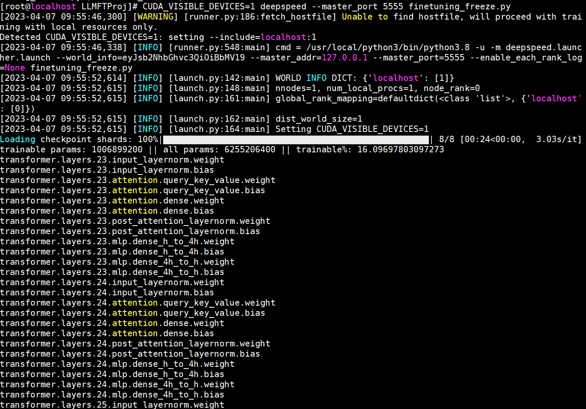
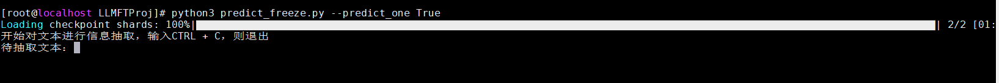
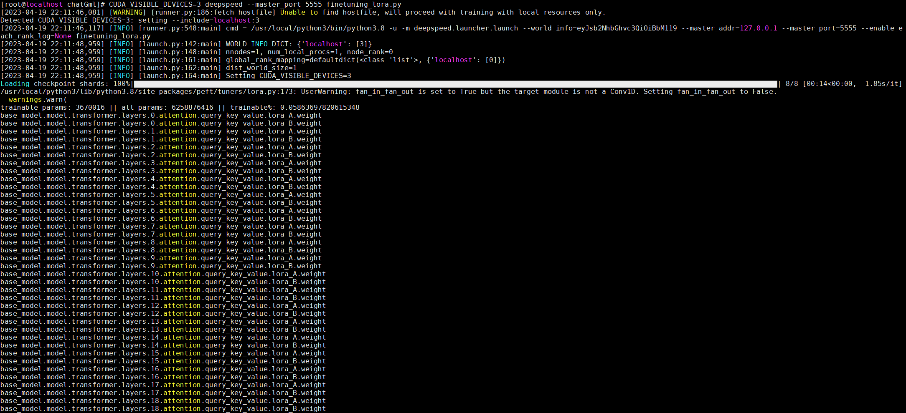
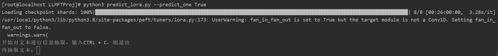
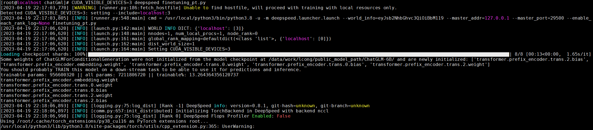

本项目为书籍《ChatGPT原理与实战：大型语言模型的算法、技术和私有化》中第6章《大模型预训练》实战部分代码-基于大型语言模型的信息抽取实战。

## 项目简介

针对信息抽取数据集，对ChatGLM模型进行微调，帮助读者深入了解大型语言模型在微调过程中的原理、流程和注意事项等。

项目主要结构如下：

- data 存放数据的文件夹
    - ori_data.json 原始信息抽取数据
    - sample.json 处理后语料样例
- pretrain_model 预训练文件路径
    - config.json
    - ice_text.model
    - tokenizer_config.json
    - pytorch_model.bin.index.json
    - pytorch_model-00001-of-00008.bin
    - pytorch_model-00002-of-00008.bin
    - pytorch_model-00003-of-00008.bin
    - pytorch_model-00004-of-00008.bin
    - pytorch_model-00005-of-00008.bin
    - pytorch_model-00006-of-00008.bin
    - pytorch_model-00007-of-00008.bin
    - pytorch_model-00008-of-00008.bin
- data_helper.py 数据预处理文件
- data_set.py 模型所需数据类文件
- modeling_chatglm.py 模型文件
- configuration_chatglm.py 模型配置参数文件
- tokenization_chatglm.py 模型分词器文件
- finetuning_freeze.py Freeze方法模型微调文件
- predict_freeze.py Freeze方法模型推理文件
- finetuning_lora.py LoRA方法模型微调文件
- predict_lora.py LoRA方法模型推理文件
- finetuning_pt.py P-Tuning方法模型微调文件
- predict_pt.py P-Tuning方法模型推理文件

注意：由于GitHub不方便放模型文件，因此pretrain_model文件夹中的模型bin文件，请从百度云盘中下载。

| 文件名称 | 下载地址 | 提取码 |
| --- |--- |---|
| pretrain_model | [百度云](https://pan.baidu.com/s/1NLaA09MlM1y4BFOXrmA1JQ) | vvpg |

## 环境配置

模型训练或推理所需环境，请参考requirements.txt文件。

## 数据处理

数据预处理需要运行data_helper.py文件，会在data文件夹中生成训练集和测试集文件。

命令如下：

```shell
python3 data_helper.py
```

注意：如果需要修改数据生成路径或名称，请修改data_helper.py文件55-58行，自行定义。单个样本示例如下：

```json
{
  "text": "故障现象：发动机水温高，风扇始终是低速转动，高速档不工作，开空调尤其如此。",
  "answer": "发动机_部件故障_水温高\n风扇_部件故障_低速转动"
}  
```

## Freeze微调

### 模型训练

模型训练需要运行finetuning_freeze.py文件，会自动生成output_dir_freeze文件夹，存放每个epoch保存的模型文件。

命令如下：

```shell
CUDA_VISIBLE_DEVICES=0 deepspeed finetuning_freeze.py \
                 --num_train_epochs 5 \
                 --train_batch_size 2 \
                 --output_dir output_dir_freeze/ \
                 --max_len 768 \
                 --max_src_len 450   
```

注意：当服务器资源不同或读者更换数据等时，可以在模型训练时修改响应参数，详细参数说明见代码或阅读书6.5.3小节。

模型训练示例如下：



### 模型推理

模型训练需要运行predict_freeze.py文件，采用自己训练后的模型。

命令如下：

```shell
# 控制台单条预测
python3 predict_freeze.py --predict_one True 
or
# 文件批量预测
python3 predict_freeze.py --test_path data/spo_1.json --predict_one False
```

注意：如果修改模型路径，请修改--model_path参数。

模型推理示例如下：


```text
样例1：
待抽取文本：故障现象：发动;机怠速不规则抖动，故障灯亮
抽取三元组内容：['故障灯_部件故障_亮', '机怠速_性能故障_不规则抖动']
样例2：
待抽取文本：现象6:更换干式水表中换好水表与密封圈后，还出现渗漏故障。(1)故障原因分析：1)上表法兰片时，用力不均匀使法兰片倾斜。2)密封圈处有泥砂。(2)处理措施：1)上表法兰片时，应对角平衡上紧螺栓。2)密封圈处泥砂要擦干净。
抽取三元组内容：['密封圈_部件故障_有泥砂', '法兰片_部件故障_有泥砂']
```

## LoRA微调

### 模型训练

模型训练需要运行finetuning_lora.py文件，会自动生成output_dir_lora文件夹，存放每个epoch保存的模型文件。

命令如下：

```shell 
CUDA_VISIBLE_DEVICES=0 deepspeed finetuning_lora.py \
                 --num_train_epochs 5 \
                 --train_batch_size 2 \
                 --output_dir output_dir_lora/ \
                 --max_len 768 \
                 --max_src_len 450 \
                 --lora_r 8
```

注意：当服务器资源不同或读者更换数据等时，可以在模型训练时修改响应参数，详细参数说明见代码或阅读书6.5.4小节。

模型训练示例如下：



### 模型推理

模型训练需要运行predict_lora.py文件，采用自己训练后的模型。

命令如下：

```shell
# 控制台单条预测
python3 predict_lora.py --predict_one True
or
# 文件批量预测
python3 predict_lora.py --test_path data/spo_1.json --predict_one False
```

注意：如果修改模型路径，请修改--model_path参数。

模型推理示例如下：


```text
样例1：
待抽取文本：故障现象：奔腾B70做PDI检查时车辆无法启动
抽取三元组内容：['车_部件故障_无法启动']
样例2：
待抽取文本：处理原则：A）检查当地监控系统告警及动作信息，相关电流、电压数据，若相应极未闭锁，应将其紧急停运。B）立即向值班调控人汇报，及时通知消防部门。C）应注意单极闭锁对另一极的影响，及时配合调控对直流输送功率及运行方式进行调整。D）检查记录控制保护及自动装置动作信息，核对设备动作情况，检查设备着火情况。E）将着火的直流分压器设备转为检修，并在保证人身安全的前提下，用灭火器材灭火
抽取三元组内容：['单极_部件故障_闭锁', '设备_部件故障_着火', '极_部件故障_未闭锁']
```

## P-Tuning V2微调

### 模型训练

模型训练需要运行finetuning_pt.py文件，会自动生成output_dir_pt文件夹，存放每个epoch保存的模型文件。

命令如下：

```shell 
CUDA_VISIBLE_DEVICES=0 deepspeed finetuning_pt.py \
                 --num_train_epochs 5 \
                 --train_batch_size 2 \
                 --output_dir output_dir_lora/ \
                 --max_len 768 \
                 --max_src_len 450 \
                 --pre_seq_len 8 \
                 --prefix_projection True 
```

注意：当服务器资源不同或读者更换数据等时，可以在模型训练时修改响应参数，详细参数说明见代码或阅读书6.5.5小节。

模型训练示例如下：



### 模型推理

模型训练需要运行predict_pt.py文件，采用自己训练后的模型。

命令如下：

```shell
# 控制台单条预测
python3 predict_pt.py --predict_one True
or
# 文件批量预测
python3 predict_pt.py --test_path data/spo_1.json --predict_one False
```

注意：如果修改模型路径，请修改--model_path参数。

模型推理示例如下：


```text
样例1：
待抽取文本：故障现象：发动机噪音大。
抽取三元组内容：['发动机_部件故障_噪音大']
样例2：
待抽取文本：原因分析：夜行灯，照明灯由同一开关(大灯组合开关TNS档位)控制。保险丝由一条共用主保险120A和照明灯独立保险5A、夜行灯独立保险15A组成(线路图见附件二)。室内照明灯线路分布：手自一体开关、自动空调控制器、危险警报开关、音响控制单元、方向盘音响开关、组合仪表等仪表台照明灯。夜行灯线路分布：左右前位置灯、左右后行车灯和牌照灯。可能原因：手自一体开关、自动空调控制器、危险警报开关、音响控制单元、方向盘音响开关、组合仪表等故障，线路故障。解决措施：处理方向盘音响按扭线束
抽取三元组内容：['危险警报开关_部件故障_故障', '线路_组成_照明灯', '音响控制单元_部件故障_故障', '接线_组成_手自一体开关', '组合仪表_部件故障_故障', '方向盘音响开关_部件故障_故障', '夜行灯线路_部件故障_故障', '手自一体开关_部件故障_故障', '自动空调控制器_部件故障_故障']
```

## 总结

本项目中的代码包含大量的注释信息，帮助读者更容易的阅读代码、以及了解其原理。读者跑通代码的后，可以根据自己特定的任务，定向修改配置参数或代码，实现自己响应的功能。