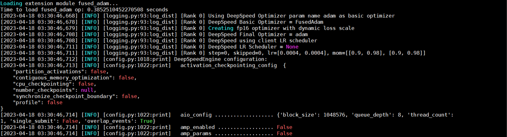
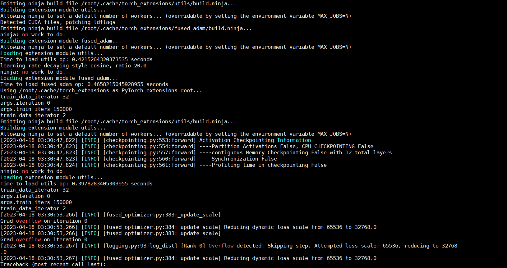
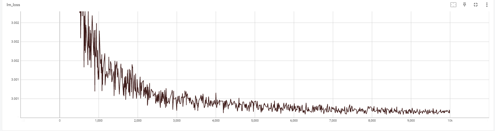

本项目为书籍《ChatGPT原理与实战：大型语言模型的算法、技术和私有化》中第6章《大模型预训练》实战部分代码-基于大型语言模型的预训练实战。

## 项目简介

本节介绍基于大型语言模型的预训练实战，选取清华大学知识工程研究提出的生成式语言模型（[Generative Language Modeling](https://arxiv.org/abs/2103.10360)
，GLM）进行预训练模型实战以及DeepSpeed作为分布式框架进行大模型预训练实战

项目主要结构如下：

- glm_pretrain
    - model 存放模型字典路径
    - data 存放预训练数据集路径
- configs 配置项
    - arguments.py 训练所必要的Args获取方法
    - config_block_base.json DeepSpeed配置文件
    - configs.json 基础训练配置文件
    - configs.py 模型配置加载
- dataset 数据处理模块
    - blocklm_utils.py 数据加载部分
    - dataset.py 数据处理模块，构建DataSet
    - file_utils.py 文件综合处理方法
    - __init__.py 初始化方法
    - samplers.py 调度器函数
    - sp_tokenizer.py sp_tokenizer加载方法
    - tokenization.py 分词器初始化方法
    - wordpiece.py WordPiece分词器
- model 模型综合模块
    - distributed.py 分布式处理方法
    - learning_rates.py 学习率更新函数
    - modeling_glm.py GLM综合模型
    - model.py 模型初始化方法
- mpu 分布式模型相关要素
    - cross_entropy.py 交叉熵loss函数
    - data.py 数据并行模块
    - grads.py 梯度更新
    - initialize.py 模型初始化
    - __init__.py 初始化方法
    - layers.py 模型中间层
    - mappings.py 分布式并行执行方法
    - random.py 设置随机种子
    - transformer.py transfomer模块
    - utils.py 分布式所需的utils模块
- pretrain_model.py 训练模型主函数
- scripts 运行脚本文件夹
    - run_pretrain.sh 执行预训练的脚本文件
- utils.py utiles模块

注意：由于GitHub不方便放相关训练数据data.json，请从百度云盘中下载，下载完毕后直接替换根目录中的glm_pretrain文件夹。本项目设计

| 文件名称 | 下载地址 | 提取码 |
| --- |--- |---|
| glm_pretrain | [百度云](https://pan.baidu.com/s/1XyiXxYaozhu3EJ7ZuOPI7Q) | vtio|

## 环境准备

由于当前环境配置较为复杂，建议采用Docker镜像镜像部署，镜像已推送指dockerhub，可以通过以下命令拉取相关镜像。

命令如下：

```shell
docker pull junkroy/glmpretrain
```

可以通过以下命令创建容器：

```shell
docker run -it --gpus=all --name glm_pretrain junkroy/glmpretrain /bin/bash
```

若打算本机运行，则模型训练所需环境，请参考requirements.txt文件。

## 数据处理

本训练的数据处理已集成在训练中，无需额外单独处理数据。

## 模型训练

相关训练配置参数位于 configs/configs.json 中，根据需求可以镜像修改。

由于当前采用DeepSpeed框架进行分布式训练，DeepSpeed的训练配置位于configs/config_block_base.json 中，根据需求可以镜像修改。

模型训练需要运行pretrain_model.py文件，模型将保存至glm_pretrain/model/ 中，存放每个epoch保存的模型文件。

命令如下：

```shell
CUDA_VISIBLE_DEVICES=0,1  deepspeed pretrain_model.py
```

注意：当服务器资源不同或读者更换数据等时，可以在模型训练时修改响应参数，相关训练配置参数位于 configs/configs.json 中。

DeepSpeed运行状态示意图如下：



DeepSpeed训练示意图如下：



模型训练阶段损失值及验证集准确率变化如下：


若当前算力资源充足,可以进行多机多卡并行训练，相关命令如下：

```shell
bash scripts/ds_pretrain_multi.sh config/ds_block_large.json
```

其中DeepSpeed的训练配置位于configs/config_block_large.json
中，根据需求进行，同步地，请修改pretrain_model.py代码第617行config_path为configs/config_block_large.json，并执行上述命令。

## 总结

本项目中的代码包含大量的注释信息，帮助读者更容易的阅读代码、以及了解其原理。读者跑通代码的后，可以根据自己特定的任务，定向修改配置参数或代码，实现自己响应的功能。