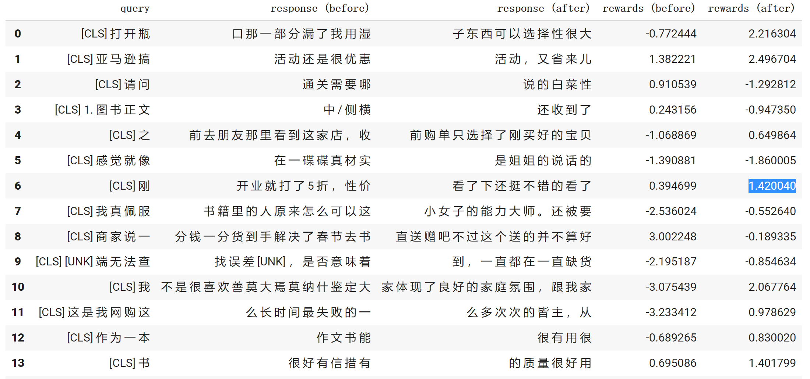

本项目为书籍《ChatGPT原理与实战：大型语言模型的算法、技术和私有化》中第8章《0.4.1》实战部分代码-基于PPO的正向情感倾向性生成项目实战。

## 项目简介

针对酒店评论数据集，利用BERT模型在小样本数据下进行模型训练及测试，运用PPO算法对生成结果进行干预，使其生成结果更具有正向倾向。

项目主要结构如下：

- gpt_chinese_cluecorpussmall：利用中文CLUE数据集训练的生成预训练模型
    - config.json
    - pytorch_model.bin
    - vocab.txt
- Erlangshen_Roberta_110M_Sentiment：已训练好的中文情感分类模型
    - config.json
    - pytorch_model.bin
    - vocab.txt
- ppo_review_generate：本次模型生成结果文件
    - config.json
    - pytorch_model.bin
    - vocab.txt
- data_set.py：模型所需数据类文件
- train.py：模型训练文件
- generate_sample.py：模型生成样本文件

注意：

由于GitHub不方便放模型文件，因此ppo_review_generate文件夹、gpt_chinese_cluecorpussmall文件夹和Erlangshen_Roberta_110M_Sentiment文件夹，请从百度云盘中下载。

| 文件名称 | 下载地址 | 提取码 |
| --- |--- |---|
| gpt_chinese_cluecorpussmall | [百度云](https://pan.baidu.com/s/1G8qfyZqrWu1zIVhx_5f5Yw) | r5bq |
| Erlangshen_Roberta_110M_Sentiment |[百度云](https://pan.baidu.com/s/1gstcmFB8I-uZqrYZh3hq0g) | iejr |
| ppo_review_generate |[百度云](https://pan.baidu.com/s/1UU8caTj72kOwRlYmdZub7A) | rqp0 |

模型训练数据，在训练代码执行时会自动下载，详见data_set.py文件41行。

## 环境配置

模型训练或推理所需环境，请参考requirements.txt文件。

## 模型训练

模型训练需要运行train.py文件，会自动生成output_dir所对应的文件夹，存放每个epoch保存的模型文件。

命令如下：

```shell
python3 train.py --device 0 \
                 --actor_model_name "gpt2_chinese_cluecorpussmall" \
                 --critic_model_name "Erlangshen_Roberta_110M_Sentiment" \
                 --data_dir "data/" \
                 --output_dir "ppo_review_generate/"
```

注意：当服务器资源不同或读者更换数据等时，可以在模型训练时修改响应参数，详细参数说明见代码或阅读书8.3.3小节。

## 模型推理

模型训练需要运行generate_sample.py文件，可以采用项目中以提供的模型，也可以采用自己训练后的模型。

命令如下：

```shell
python3 generate_sample.py --device 0 \
                           --model_path "ppo_review_generate" \
                           --max_len 256
```

注意：如果修改模型路径，请修改--model_path参数。

模型推理示例如下：


```text
样例1：
打开瓶子东西可以选择性很大。
情感极性：正向 2.216304
样例2：
亚马逊搞活动，又省。
情感极性：正向 2.496704
样例3：
之前购单只选择了刚买好的宝贝	
情感极性：正向 0.649864
样例4：
刚看了下还挺不错的看了
情感极性：正向 1.420040
```

## 总结

本项目中的代码包含大量的注释信息，帮助读者更容易的阅读代码、以及了解其原理。读者跑通代码的后，可以根据自己特定的任务，定向修改配置参数或代码，实现自己响应的功能。