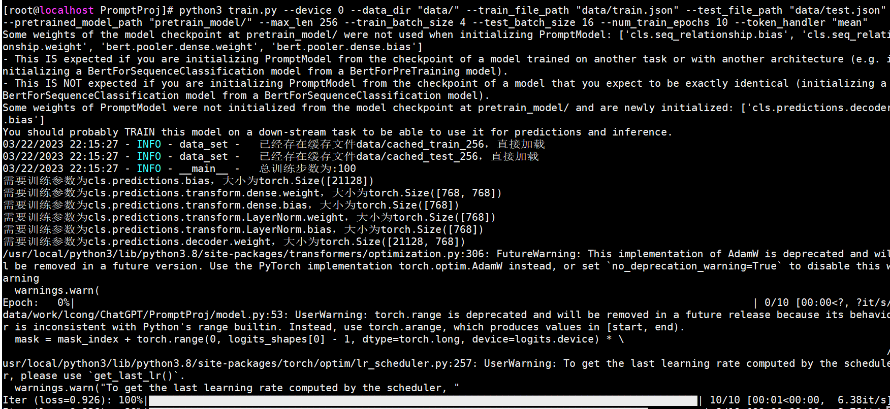
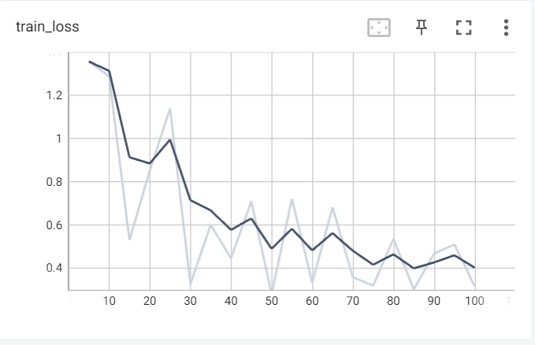
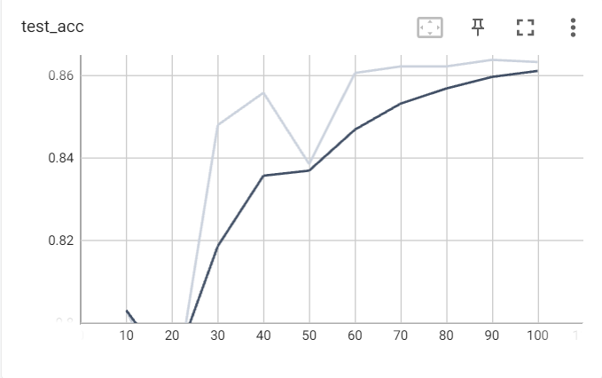

本项目为书籍《ChatGPT原理与实战：大型语言模型的算法、技术和私有化》中第5章《提示学习与大模型的涌现》实战部分代码-基于Prompt的文本情感分析实战。

## 项目简介

针对酒店评论数据集，利用BERT模型在小样本数据下进行模型训练及测试，更深入地了解Prompt任务进行下游任务的流程。

项目主要结构如下：

- data 存放数据的文件夹
    - ChnSentiCorp_htl_all.csv 原始酒店评论情感数据
    - sample.json 处理后的语料样例
- prompt_model 已训练好的模型路径
    - config.json
    - pytorch_model.bin
    - vocab.txt
- pretrain_model 预训练文件路径
    - config.json
    - pytorch_model.bin
    - vocab.txt
- data_helper.py 数据预处理文件
- data_set.py 模型所需数据类文件
- model.py 模型文件
- train.py 模型训练文件
- predict.py 模型推理文件

注意：由于GitHub不方便放模型文件，因此prompt_model文件夹和pretrain_model文件夹中的模型bin文件，请从百度云盘中下载。

| 文件名称 | 下载地址 | 提取码 |
| --- |--- |---|
| pretrain_model | [百度云](https://pan.baidu.com/s/1Rlyp5hQNosxjBDq-6XwrEA) | tdzo |
| prompt_model |[百度云](https://pan.baidu.com/s/1802NsUg-WVCjztt4kfoPBQ) | fjd9 |

## 环境配置

模型训练或推理所需环境，请参考requirements.txt文件。

## 数据处理

数据预处理需要运行data_helper.py文件，会在data文件夹中生成训练集和测试集文件。

命令如下：

```shell
python3 data_helper.py
```

注意：如果需要修改数据生成路径或名称，请修改data_helper.py文件66-68行，自行定义。

## 模型训练

模型训练需要运行train.py文件，会自动生成output_dir文件夹，存放每个epoch保存的模型文件。

命令如下：

```shell
python3 train.py --device 0 \
                 --data_dir "data/" \
                 --train_file_path "data/train.json" \
                 --test_file_path "data/test.json" \
                 --pretrained_model_path "pretrain_model/" \
                 --max_len 256 \
                 --train_batch_size 4 \
                 --test_batch_size 16 \
                 --num_train_epochs 10 \
                 --token_handler "mean" 
```

注意：当服务器资源不同或读者更换数据等时，可以在模型训练时修改响应参数，详细参数说明见代码或阅读书5.4.4小节。

模型训练示例如下：



模型训练阶段损失值及验证集准确率变化如下：




## 模型推理

模型训练需要运行predict.py文件，可以采用项目中以提供的模型，也可以采用自己训练后的模型。

命令如下：

```shell
python3 predict.py --device 0 --max_len 256
```

注意：如果修改模型路径，请修改--model_path参数。

模型推理示例如下：


```text
样例1：
输入的评论数据：这家酒店是我在携程定的酒店里面是最差的，房间设施太小气，环境也不好，特别是我住的那天先是第一晚停了一会儿电，第二天停水，没法洗漱，就连厕所也没法上，糟糕头顶。
情感极性：负向
样例2：
输入的评论数据：这个宾馆的接待人员没有丝毫的职业道德可言。我以前定过几次这个宾馆，通常情况下因为入住客人少，因此未发生与他们的冲突，此于他们说要接待一个团，为了腾房，就要强迫已入住的客人退房，而且态度恶劣，言语嚣张，还采用欺骗手段说有其他的房间。
情感极性：负向
样例3：
输入的评论数据：香港马可最吸引人的地方当然是她便利的条件啦；附近的美心酒楼早茶很不错（就在文化中心里头），挺有特色的；
情感极性：正向
样例4：
输入的评论数据：绝对是天津最好的五星级酒店，无愧于万豪的品牌！我住过两次，感觉都非常好。非常喜欢酒店配备的CD机，遥控窗帘，卫生间电动百页窗。早餐也非常好，品种多品质好。能在早餐吃到寿司的酒店不多，我喜欢这里的大堂，很有三亚万豪的风范！
情感极性：正向
```

## 总结

本项目中的代码包含大量的注释信息，帮助读者更容易的阅读代码、以及了解其原理。读者跑通代码的后，可以根据自己特定的任务，定向修改配置参数或代码，实现自己响应的功能。