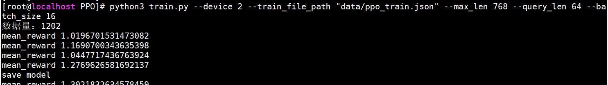
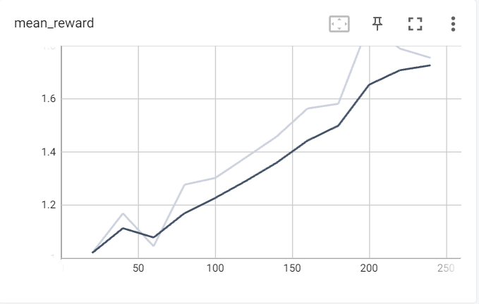

本项目为书籍《ChatGPT原理与实战：大型语言模型的算法、技术和私有化》中第9章《类ChatGPT实战》实战部分代码-RL阶段。

## 项目简介

RL阶段实战，通过强化学习PPO算法对SFT模型进行优化，帮助读者深入理解ChatGPT模型在RL阶段的任务流程。

项目主要结构如下：

- data 存放数据的文件夹
    - ppo_train.json 用于强化学习的文档数据
- rm_model RM阶段训练完成模型的文件路径
    - config.json
    - pytorch_model.bin
    - vocab.txt
- sft_model SFT阶段训练完成模型的文件路径
    - config.json
    - pytorch_model.bin
    - vocab.txt
- ppo_model PPO阶段训练完成模型的文件路径
    - config.json
    - pytorch_model.bin
    - vocab.txt
- data_set.py 模型所需数据类文件
- model.py 模型文件
- train.py 模型训练文件
- predict.py 模型推理文件

注意：由于GitHub不方便放模型文件，因此sft_model文件夹、rm_model文件夹和ppo_model文件夹中的模型bin文件，请从百度云盘中下载。

| 文件名称 | 下载地址 | 提取码 |
| --- |--- |---|
| sft_model | [百度云](https://pan.baidu.com/s/1OH-dBIG8CsR0EXOTpW5cYA) | iks4|
| rm_model |[百度云](https://pan.baidu.com/s/1uABE1lbLjZwKiG_4uovzxA) |64wt|
| ppo_model |[百度云](https://pan.baidu.com/s/1GazJPXwGgS7VDLn0fteISg) |s8b7|

## 环境配置

模型训练或推理所需环境，请参考[requirements.txt](../requirements.txt)文件。

## 模型训练

模型的训练流程如下所示：


模型训练需要运行train.py文件，会自动生成output_dir文件夹，存放每个epoch保存的模型文件。

命令如下：

```shell
python3 train.py --device 0 \
                 --train_file_path "data/ppo_train.json" \
                 --max_len 768 \
                 --query_len 64 \
                 --batch_size 16
```

注意：当服务器资源不同或读者更换数据等时，可以在模型训练时修改响应参数，详细参数说明见代码或阅读书9.3.3小节。

模型训练示例如下：



模型训练阶段损失值变化如下：



## 模型推理

模型训练需要运行predict.py文件，可以采用项目中以提供的模型，也可以采用自己训练后的模型。

命令如下：

```shell
python3 predict.py --device 0 --model_path ppo_model
```

注意：如果修改模型路径，请修改--model_path参数。

模型推理示例如下：


```text
样例1：
输入的正文为：大莱龙铁路位于山东省北部环渤海地区，西起位于益羊铁路的潍坊大家洼车站，向东经海化、寿光、寒亭、昌邑、平度、莱州、招远、终到龙口，连接山东半岛羊角沟、潍坊、莱州、龙口四个港口，全长175公里，工程建设概算总投资11.42亿元。铁路西与德大铁路、黄大铁路在大家洼站接轨，东与龙烟铁路相连。
生成的第1个问题为：该项目建成后对于做什么？
生成的第2个问题为：该铁路线建成后会带动什么方面？
样例2：
输入的正文为：椰子猫（学名：'），又名椰子狸，为分布于南亚及东南亚的一种麝猫。椰子猫平均重3.2公斤，体长53厘米，尾巴长48厘米。它们的毛粗糙，一般呈灰色，脚、耳朵及吻都是黑色的。它们的身体上有三间黑色斑纹，面部的斑纹则像浣熊，尾巴没有斑纹。椰子猫是夜间活动及杂食性的。它们在亚洲的生态位与在北美洲的浣熊相近。牠们栖息在森林、有树木的公园及花园之内。它们的爪锋利，可以用来攀爬。椰子猫分布在印度南部、斯里兰卡、东南亚及中国南部。
生成的第1个问题为：椰子猫是什么族群？
生成的第2个问题为：椰子猫到底是什么？
```

## 总结

本项目中的代码包含大量的注释信息，帮助读者更容易的阅读代码、以及了解其原理。读者跑通代码的后，可以根据自己特定的任务，定向修改配置参数或代码，实现自己响应的功能。