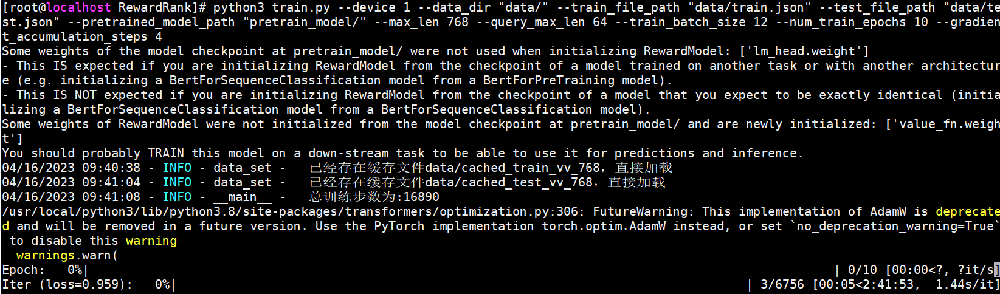
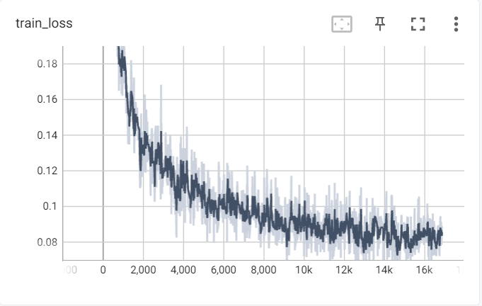

本项目为书籍《ChatGPT原理与实战：大型语言模型的算法、技术和私有化》中第9章《类ChatGPT实战》实战部分代码-RM阶段。

## 项目简介

RM阶段实战，通过训练文档-问题匹配模型更深入地理解ChatGPT模型在RM阶段的任务流程。

项目主要结构如下：

- data 存放数据的文件夹
    - cmrc_train.json 原始机器阅读理解训练数据
    - cmrc_dev.json 原始机器阅读理解测试数据
- rm_model 已训练好的模型路径
    - config.json
    - pytorch_model.bin
    - vocab.txt
- pretrain_model 模型初始化文件路径
    - config.json
    - pytorch_model.bin
    - vocab.txt
- data_helper.py 数据预处理文件
- data_set.py 模型所需数据类文件
- model.py 模型文件
- train.py 模型训练文件
- predict.py 模型推理文件

注意：由于GitHub不方便放模型文件，因此rm_model文件夹和pretrain_model文件夹中的模型bin文件，请从百度云盘中下载。

| 文件名称 | 下载地址 | 提取码 |
| --- |--- |---|
| pretrain_model | [百度云](https://pan.baidu.com/s/1sT3dFJUgxX2BvPNWFz3NaA) | k1of|
| rm_model |[百度云](https://pan.baidu.com/s/1zy5x85T1823_XZp7W-JBiw) |i21q|

## 环境配置

模型训练或推理所需环境，请参考[requirements.txt](../requirements.txt)文件。

## 数据处理

数据预处理需要运行data_helper.py文件，会在data文件夹中生成训练集和测试集文件。

命令如下：

```shell
python3 data_helper.py
```

注意：如果需要修改数据生成路径或名称，请修改data_helper.py文件142-149行，自行定义。

## 模型训练

模型训练需要运行train.py文件，会自动生成output_dir文件夹，存放每个epoch保存的模型文件。

命令如下：

```shell
python3 train.py --device 0 \
                 --data_dir "data/" \
                 --train_file_path "data/train.json" \
                 --test_file_path "data/test.json" \
                 --pretrained_model_path "pretrain_model/" \
                 --max_len 768 \
                 --query_max_len 64 \
                 --train_batch_size 12 \
                 --num_train_epochs 10 \
                 --gradient_accumulation_steps 4   
```

注意：当服务器资源不同或读者更换数据等时，可以在模型训练时修改响应参数，详细参数说明见代码或阅读书9.3.2小节。

模型训练示例如下：



模型训练阶段损失值变化如下：



## 模型推理

模型训练需要运行predict.py文件，可以采用项目中以提供的模型，也可以采用自己训练后的模型。

命令如下：

```shell
python3 predict.py --device 0 --model_path rm_model
```

注意：如果修改模型路径，请修改--model_path参数。

模型推理示例如下：


```text
样例1：
输入的文本为：全镇总面积72平方公里，人口1.82万人口。罗店镇辖境于1959年始设双龙人民公社罗店管理区，1979年改为罗店人民公社。1983年撤消人民公社，改设罗店乡。1986年改设罗店镇。
输入的问题为：全镇总面积多少？
上述文本和问题的匹配度分数为：0.9986565113067627
样例2：
输入的文本为：全镇总面积72平方公里，人口1.82万人口。。罗店镇辖境于1959年始设双龙人民公社罗店管理区，1979年改为罗店人民公社。1983年撤消人民公社，改设罗店乡。1986年改设罗店镇。
输入的问题为：今年CBA总冠军是哪个队
上述文本和问题的匹配度分数为：0.33825352787971497
样例3：
输入的文本为：全镇总面积72平方公里，人口1.82万人口。。罗店镇辖境于1959年始设双龙人民公社罗店管理区，1979年改为罗店人民公社。1983年撤消人民公社，改设罗店乡。1986年改设罗店镇。
输入的问题为：全镇
上述文本和问题的匹配度分数为：0.061305247247219086
```

## 总结

本项目中的代码包含大量的注释信息，帮助读者更容易的阅读代码、以及了解其原理。读者跑通代码的后，可以根据自己特定的任务，定向修改配置参数或代码，实现自己响应的功能。